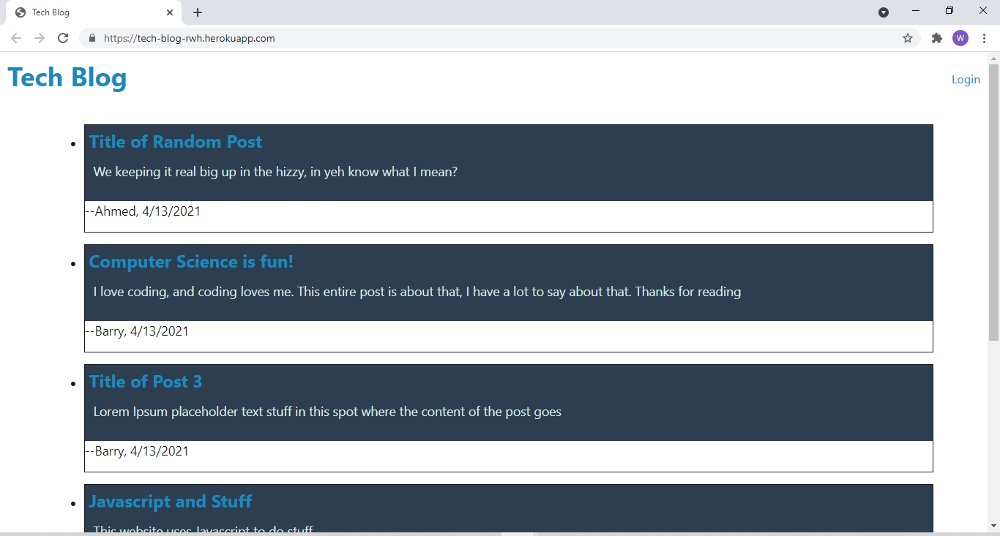

# 14 Model-View-Controller (MVC): Tech Blog

This is an app where you can signup and login to post messages with other tech lovers. Once loggged in you can also comment on posts or edit posts you have made. Comments and posts will display with the user name of the person who posted, as well as the date it was posted. 

## Homepage

## Tech used
* express-handlebars
* express   
* bcrypt
* connect-session-sequelize 
* dotenv
* express-session
* mysql2
* sequelize

## License
  ​
This project is licensed under the Unlicensed license.
  
## Questions
  ​
If you have any questions about the repo, open an issue or contact me directly at BigRonald42@hotmail.com. You can find more of my work at [GitHub](https://github.com/BiggRonn/).

## Link to Deployed App
https://tech-blog-rwh.herokuapp.com/